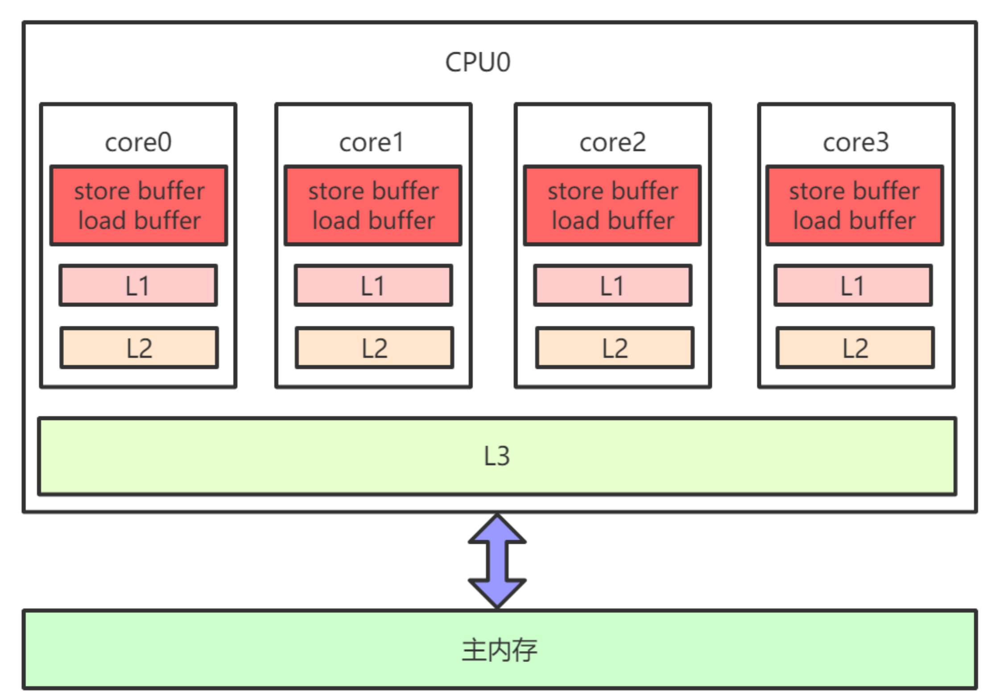
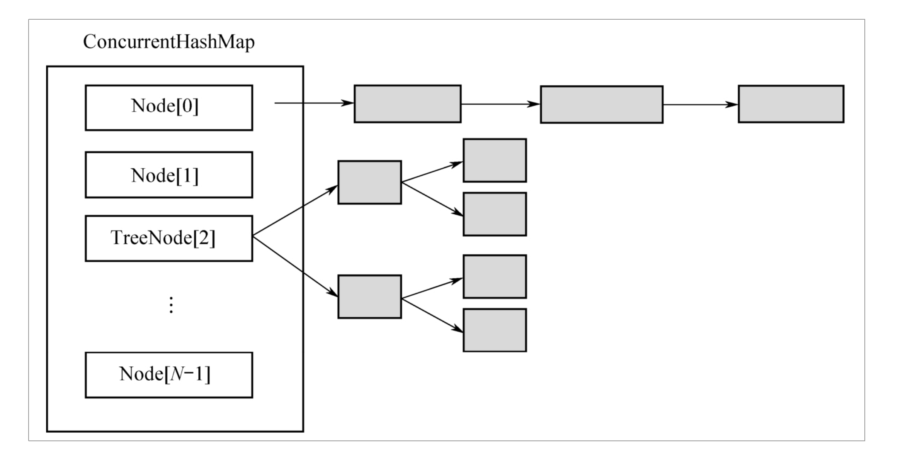

# 并发编程原理

## 常用关键字

### 1、Thread和Runnable

创建线程的两种方式，线程有六种状态

- NEW：Thread对象已经创建，但是还没有开始执行。
- RUNNABLE：Thread对象正在Java虚拟机中运行
- BLOCKED：线程正在等待锁定
- WAITING：线程在等待另一个线程动作
- TIME_WAITING：线程在等待另一个线程动作，但是有时间限制
- TERMINATED：线程已经执行完毕

​      **初始线程处于NEW状态，调用start()开始执行后，进入RUNNING或者READY状态。如果没有调用任何的阻塞函数，线程只会在RUNNING和READY之间切换，也就是系统的时间片调度。这两种状态的切换是操作系统完成的，除非手动调用yield()函数，放弃对CPU的占用。如果调用了任何阻塞函数，线程就会进入WAITING或者TIMED_WAITING状态，如果使用了synchronized关键字或者synchronized块，则会进入BLOCKED状态。**

Thread类常用方法：

- interrupt()：中断目标线程，给目标线程发送一个中断信号，线程被打上中断标记。精确含义是“唤醒轻量级阻塞“
- interrupted()：判断目标线程是否被中断，但是将清除线程的中断标记。
- isinterrupted()：判断目标线程是否被中断，不会清除中断标记。

### 2、synchronized

- **修饰实例方法：**作用于当前对象实例加锁，进入同步代码前要获得当前对象实例的锁
- **修饰静态方法：**给当前类加锁，作用于类的所有对象实例
- **修饰代码块：**指定加锁对象，对该对象加锁

底层原理：

1. 修饰同步语句块的时候：使用的是 monitorenter 和 monitorexit 指令，monitorenter 指向同步代码块的开始位置，monitorexit指向同步代码块的结束位置
2. 修饰方法的时候：没有monitorenter和monitorexit，使用的 ACC_SYNCHRONIZED 标识，JVM通过此标识判断一个方法是否是同步方法。

在对象头中有一个Mark World，里面有两个重要的字段，锁标志位(state)和占用该锁的thread ID，标识位记录自己有没有被线程占用。

### 3、interrupt

thread.isInterrupted()与Thread.interrupted()的区别：都是线程用来判断自己是否收到中断信号的，前者只读取中断状态，不修改状态，后者不仅读取中断状态，还会重置中断标志位。

## JMM

每个核上面有L1、L2缓存，L3缓存为所有核共用。因为存在CPU缓存一致致性协议，例如MESI，多个CPU核心之间缓存不会出现不同步的问题，不会有“内存可见性”问题。L1、L2、L3和主内存之间是同步的，有缓存一致性协议的保证，但是Store Buffer、Load Buffer和L1之间却是异步的。每个线程都会有本地缓存，本地缓存要和主内存进行同步。

重排序类型：

- 编译器重排序
- CPU指令重排序
- CPU内存重排序：造成内存可见性的主因。

为了禁止编译器重排序和CPU重排序，在编译器和CPU层面都有对应的指令，也就是**内存屏障**，这是JMM和happens-before的底层原理。编译器的内存屏障只在编译期起作用，CPU不会感知到编译器中内存屏障的存在；CPU的内存屏障是CPU提供的指令，可以由开发者显示调用。

**happens-before**描述两个操作之间的内存可见性，如果A happens before B指的是A的结果对B可见，但不一定A在B之前执行。volatile变量不能重排序，非volatile变量可以任意重排序。

1. **单线程中的每个操作，happen-before于该线程中任意后续操作。**
2. **对volatile变量的写，happen-before于后续对这个变量的读。**
3. **对synchronized的解锁，happen-before于后续对这个锁的加锁。**
4. **对final变量的写，happen-before于final域对象的读，happen-before于后续对final变量的读。**

# JUC

## 并发容器

### BlockingQueue

带阻塞功能的队列，当入队列时，若队列已满，则阻塞调用者；当出队列时，若队列为空，则阻塞调用者。

- **ArrayBlockingQueue**：**数组**实现的环形队列，核心数据结构有一个数组，队头指针takeIndex，队尾指针putIndex，数量count，有一个锁和两个条件。
-  **LinkedBlockingQueue**：基于**单向链表**的阻塞队列，因为队头和队尾是2个指针分开操作的，所以用了2把锁+2个条件，AtomicInteger的原子变量记录count数。
- **PriorityBlockingQueue**：按照元素的优先级从小到大出队列的，PriorityQueue中的2个元素之间需要可以比较大小，并实现Comparable接口。核心数据有一个数组实现的二叉堆，有个比较器，有一个锁和一个条件，数组默认值大小为11，当元素个数超过数组长度的时候会进行扩容。
- **DelayQueue**：延迟队列，按延迟时间从小到大出队列的，里面的元素要实现Delayed接口。核心有一把锁和一个非空条件，还有个优先级队列 PriorityQueue。
- **SynchronousQueue**：是一个特殊的BlockingQueue，以链表的形式实现，本身没有容量，先调用put()的时候线程会阻塞，直到另外一个线程调用take()，两个线程才同时解锁，反之亦然。

### BlockingDeque

个阻塞的双端队列，继承了BlockingQueue接口，增加了双端队列操作接口，putFirst()，putLast()，taskFirst()，takeLast()，该接口只有一个实现LinkedBlockingDeque，其核心结构是一个双向链表，

### CopyOnWrite

**CopyOnWrite**在“写”的时候，不是直接“写”源数据，而是把数据拷贝一份进行修改，再通过悲观锁或者乐观锁的方式写回。为了在“读”的时候不加锁。

 **CopyOnWriteArrayList**：核心数据结构也是一个数组，在写入数据的时候会进行加锁。

 **CopyOnWriteArraySet**：是用 Array 实现的一个 Set，保证所有元素都不重复。其内部是封装的一个CopyOnWriteArrayList。

### ConCurrentHashMap

链表和红黑树之间可以相互转换：初始的时候是链表，当链表中的元素超过某个阈值时，把链表转换成红黑树；反之，当红黑树中的元素个数小于某个阈值时，再转换为链表。

使用红黑树，当一个槽里有很多元素时，其查询和更新速度会比链表快很多。加锁的粒度并非整个ConcurrentHashMap，而是对每个头节点分别加锁。

## 同步工具类

### Semaphore

信号量，提供了资源数量的并发访问控制。底层基于AQS，有公平和非公平两种实现方式

### CountDownLatch

假设一个主线程要等待5个 Worker 线程执行完才能退出，可以使用CountDownLatch来实现。底层基于AQS，没有公平和非公平之分。

### CyclicBarrier

用于协调多个线程同步执行操作的场合。底层基于ReentrantLock+Condition实现。

### Exchanger

用于线程之间交换数据，其使用代码很简单，是一个exchange()方法。核心机制和Lock一样，也是CAS+park/unpark。Exchanger内部有两个内部类：Participant（继承ThreadLocal）和Node，每个线程在调用exchange()方法交换数据的时候，会先创建一个Node对象，这个Node对象就是对该线程的包装，里面包含了3个重要字段：第一个是该线程要交互的数据，第二个是对方线程交换来的数据，最后一个是该线程自身